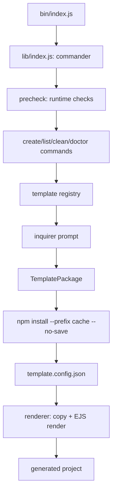
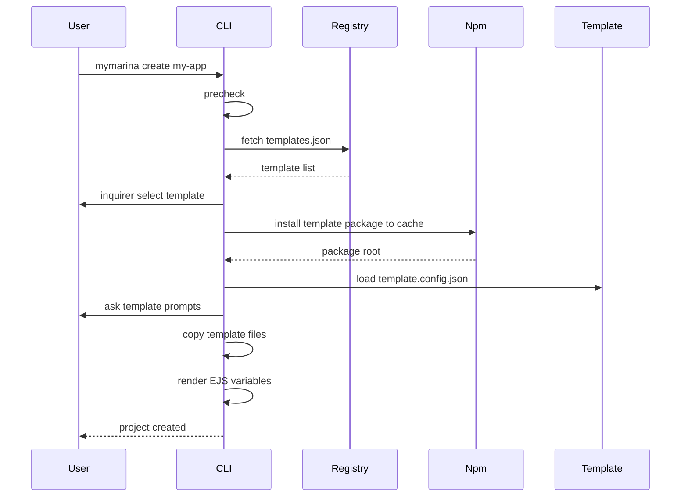

# mymarina-cli

English | [简体中文](./README.zh-CN.md)

`mymarina-cli` is a frontend project scaffolding CLI. It implements command registration, runtime prechecks, a remote template registry, interactive template selection, dynamic template package installation, local cache reuse, and EJS-based template rendering.

## Features

- Command registration and option parsing powered by `commander`
- Interactive template selection and template variable input powered by `inquirer`
- Remote template registry support, with the default registry:
  `https://raw.githubusercontent.com/AnnieLiu-dino/mymarina-template-registry/master/templates.json`
- Dynamic template package installation from npm with local CLI cache reuse
- Local template package debugging through `--packagePath`
- EJS template variable rendering, for example `<%= projectName %>`
- Template-level configuration through `template.config.json`
- Core commands including `list`, `create`, `clean`, and `doctor`
- Core module coverage using the Node.js built-in test runner

## Requirements

- Node.js >= 18
- npm >= 8

## Install

Install from npm:

```bash
npm install -g @mymarina/cli
```

Then run:

```bash
mymarina --version
mymarina --help
```

For local development, link the CLI globally:

```bash
npm install
npm link
```

Then run the linked command:

```bash
mymarina --version
mymarina --help
```

You can also run the CLI directly from source:

```bash
node bin/index.js --help
```

## Usage

List available templates:

```bash
mymarina list
```

Create a project with interactive template selection:

```bash
mymarina create my-app
```

Create a project with a specified template:

```bash
mymarina create my-app --template vue-app
```

Create a project with a specified template version:

```bash
mymarina create my-app --template vue-app --template-version 0.1.0
```

Debug with a local template package:

```bash
mymarina create my-app --packagePath ../mymarina-template-vue-app --force
```

Clean template cache:

```bash
mymarina clean
mymarina clean --all
```

Check the local environment:

```bash
mymarina doctor
```

## Commands

| Command                         | Description                                               |
| ------------------------------- | --------------------------------------------------------- |
| `mymarina create <projectName>` | Create a new project                                      |
| `mymarina list` / `mymarina ls` | List available templates                                  |
| `mymarina clean`                | Clean CLI cache                                           |
| `mymarina doctor`               | Check Node, npm, registry, CLI home, and related settings |

### create Options

| Option                         | Description                                          |
| ------------------------------ | ---------------------------------------------------- |
| `-t, --template <template>`    | Specify template name and skip interactive selection |
| `--template-version <version>` | Specify template npm package version                 |
| `--registryUrl <url>`          | Specify remote template registry URL                 |
| `--packagePath <path>`         | Specify local template package root                  |
| `--force-update`               | Force reinstall cached template package              |
| `-f, --force`                  | Overwrite target directory                           |

## Architecture



Core layers:

- `bin/index.js`: CLI executable entry
- `lib/index.js`: command registration layer based on `commander`
- `lib/core/precheck.js`: runtime checks for Node version, root user, user home, and update hints
- `lib/template/registry.js`: template discovery layer that fetches and validates the remote JSON registry
- `lib/utils/prompt.js`: prompt adapter that wraps `inquirer`, keeping business logic independent from the prompt library
- `lib/template/package.js`: template package manager for npm installation, version resolution, and cache reuse
- `lib/template/config.js`: template protocol loader for `template.config.json` and `template/`
- `lib/template/renderer.js`: template installer that copies files and renders EJS variables

## Create Flow



## Template Registry

The remote registry is a JSON array. Each record describes one template package:

```json
[
  {
    "name": "vue-app",
    "description": "Vue 3 + Vite project",
    "npmName": "@mymarina/template-vue-app",
    "version": "latest",
    "tags": ["vue3", "vite"],
    "maintainer": "mymarina"
  }
]
```

Field meanings:

| Field         | Description                                      |
| ------------- | ------------------------------------------------ |
| `name`        | Short template name used by CLI users            |
| `description` | Template description shown in `list` and prompts |
| `npmName`     | npm package name used for dynamic installation   |
| `version`     | Default install version, usually `latest`        |
| `tags`        | Template tags                                    |
| `maintainer`  | Template maintainer                              |

If the remote registry request fails, the CLI falls back to the built-in template list so basic commands can still work.

## Template Package Protocol

A template package must follow this structure:

```text
@mymarina/template-vue-app
├── package.json
├── template.config.json
└── template
    ├── package.json
    ├── index.html
    ├── vite.config.js
    └── src
        └── main.js
```

Example `template.config.json`:

```json
{
  "prompts": [
    {
      "name": "description",
      "message": "Project description",
      "default": "A Vue app created by mymarina"
    }
  ],
  "ignore": [],
  "scripts": {
    "install": "npm install",
    "dev": "npm run dev"
  }
}
```

Files inside `template/` are copied into the target project. Text files are rendered with EJS:

```json
{
  "name": "<%= projectName %>",
  "description": "<%= description %>"
}
```

After project creation, the file becomes:

```json
{
  "name": "my-app",
  "description": "A Vue app created by mymarina"
}
```

## Cache Design

Remote template packages are installed into the template cache under the CLI home:

```text
~/.marina-cli
└── templates
    └── node_modules
        └── @mymarina
            └── template-vue-app
```

Core npm install command:

```bash
npm install <templatePackage>@<version> --prefix <cachePath> --registry <registry> --no-save
```

Key points:

- `--prefix`: installs the template package into the CLI cache directory instead of the current project's `node_modules`
- `--no-save`: downloads the template package without changing the current project's `package.json`
- Cached template packages are reused when the requested version already exists
- `--force-update` forces a template package reinstall

## Environment Variables

| Variable                         | Description                                |
| -------------------------------- | ------------------------------------------ |
| `MYMARINA_TEMPLATE_REGISTRY_URL` | Override the default template registry URL |
| `MYMARINA_NPM_REGISTRY`          | Override the default npm registry          |
| `NPM_CONFIG_REGISTRY`            | Reuse npm's own registry setting           |

## Development

Install dependencies:

```bash
npm install
```

Run tests:

```bash
npm test
```

Format code:

```bash
npm run format
```

Local debugging commands:

```bash
node bin/index.js list
node bin/index.js create demo --packagePath ../mymarina-template-vue-app --force
node bin/index.js doctor
```

## Test Coverage

Current tests cover:

- `create` command flow
- `list` command output
- Template registry fetching and validation
- Template package installation, version resolution, and cache reuse
- Template config protocol validation
- EJS rendering and ignore rules
- `inquirer` prompt adapter
- npm registry utility methods
- request error wrapping
- CLI context and doctor checks

## Roadmap

Possible next steps:

- Publish more real-world templates, such as admin, component-lib, and h5
- Add template package release scripts and version checks
- Support Git initialization and automatic dependency installation
- Support dynamic command packages and move closer to a plugin-style architecture
- Add progress indicators and stronger error recovery during project creation
- Add CI for tests and release checks
