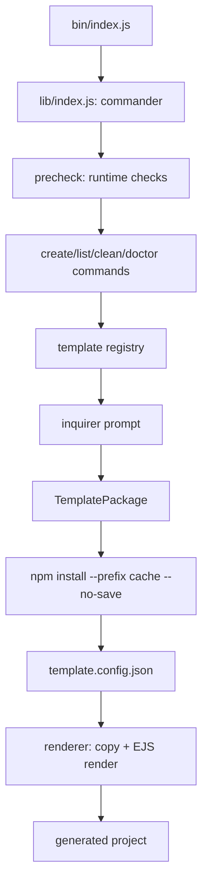
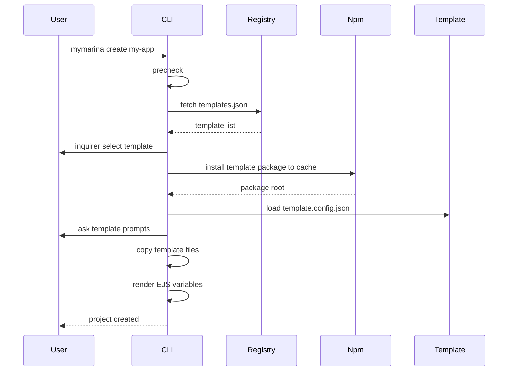

# mymarina-cli

[English](./README.md) | 简体中文

`mymarina-cli` 是一个面向前端项目初始化的脚手架 CLI。它实现了命令注册、运行前检查、远程模板注册中心、交互式模板选择、模板包动态下载、缓存复用和 EJS 模板渲染。

## Features

- 基于 `commander` 实现命令注册和参数解析
- 基于 `inquirer` 实现交互式模板选择和模板变量输入
- 支持远程模板注册中心，默认 registry：
  `https://raw.githubusercontent.com/AnnieLiu-dino/mymarina-template-registry/master/templates.json`
- 支持通过 npm 动态下载模板包，并缓存到本地 CLI home
- 支持 `--packagePath` 加载本地模板包，方便模板开发和调试
- 支持 EJS 渲染模板变量，例如 `<%= projectName %>`
- 支持模板级配置文件 `template.config.json`
- 支持 `list`、`create`、`clean`、`doctor` 等核心命令
- 使用 Node.js 内置测试框架覆盖核心模块

## Requirements

- Node.js >= 18
- npm >= 8

## Install

通过 npm 全局安装：

```bash
npm install -g @mymarina/cli
```

安装后可以直接运行：

```bash
mymarina --version
mymarina --help
```

本地开发时可以使用 `npm link` 挂载全局命令：

```bash
npm install
npm link
```

然后运行本地 link 后的命令：

```bash
mymarina --version
mymarina --help
```

也可以不 link，直接用源码运行：

```bash
node bin/index.js --help
```

## Usage

查看模板列表：

```bash
mymarina list
```

创建项目，进入交互式模板选择：

```bash
mymarina create my-app
```

指定模板创建项目：

```bash
mymarina create my-app --template vue-app
```

指定模板版本：

```bash
mymarina create my-app --template vue-app --template-version 0.1.0
```

使用本地模板包调试：

```bash
mymarina create my-app --packagePath ../mymarina-template-vue-app --force
```

清理模板缓存：

```bash
mymarina clean
mymarina clean --all
```

检查本地环境：

```bash
mymarina doctor
```

## Commands

| Command                         | Description                                   |
| ------------------------------- | --------------------------------------------- |
| `mymarina create <projectName>` | 创建一个新项目                                |
| `mymarina list` / `mymarina ls` | 查看可用模板列表                              |
| `mymarina clean`                | 清理 CLI 缓存                                 |
| `mymarina doctor`               | 检查 Node、npm、registry、CLI home 等环境信息 |

### create Options

| Option                         | Description                      |
| ------------------------------ | -------------------------------- |
| `-t, --template <template>`    | 指定模板名称，跳过交互式模板选择 |
| `--template-version <version>` | 指定模板 npm 包版本              |
| `--registryUrl <url>`          | 指定远程模板 registry 地址       |
| `--packagePath <path>`         | 指定本地模板包目录               |
| `--force-update`               | 强制重新下载模板包               |
| `-f, --force`                  | 覆盖目标目录                     |

## Architecture



核心分层：

- `bin/index.js`：CLI 入口，负责启动主程序
- `lib/index.js`：命令注册层，使用 `commander` 定义命令和参数
- `lib/core/precheck.js`：运行前检查，包括 Node 版本、root 用户、用户目录、版本更新提示
- `lib/template/registry.js`：模板发现层，从远程 JSON registry 拉取模板列表，并做结构校验
- `lib/utils/prompt.js`：交互适配层，封装 `inquirer`，避免业务代码直接依赖具体交互库
- `lib/template/package.js`：模板包管理层，负责 npm 下载、版本解析、本地缓存复用
- `lib/template/config.js`：模板协议解析层，读取 `template.config.json` 和 `template/`
- `lib/template/renderer.js`：模板安装层，复制模板文件并用 EJS 渲染变量

## Create Flow



## Template Registry

远程 registry 是一个 JSON 数组，每条记录描述一个模板包：

```json
[
  {
    "name": "vue-app",
    "description": "Vue 3 + Vite project",
    "npmName": "@mymarina/template-vue-app",
    "version": "latest",
    "tags": ["vue3", "vite"],
    "maintainer": "mymarina"
  }
]
```

字段含义：

| Field         | Description                      |
| ------------- | -------------------------------- |
| `name`        | 用户选择模板时使用的短名称       |
| `description` | 模板描述，用于 `list` 和交互选择 |
| `npmName`     | 模板 npm 包名，动态下载时使用    |
| `version`     | 默认安装版本，通常为 `latest`    |
| `tags`        | 模板标签                         |
| `maintainer`  | 模板维护者                       |

如果远程 registry 请求失败，CLI 会降级使用内置模板清单，保证基础命令仍可运行。

## Template Package Protocol

一个模板包需要满足以下结构：

```text
@mymarina/template-vue-app
├── package.json
├── template.config.json
└── template
    ├── package.json
    ├── index.html
    ├── vite.config.js
    └── src
        └── main.js
```

`template.config.json` 示例：

```json
{
  "prompts": [
    {
      "name": "description",
      "message": "Project description",
      "default": "A Vue app created by mymarina"
    }
  ],
  "ignore": [],
  "scripts": {
    "install": "npm install",
    "dev": "npm run dev"
  }
}
```

`template/` 目录里的文件会被复制到目标项目中。文本文件会经过 EJS 渲染：

```json
{
  "name": "<%= projectName %>",
  "description": "<%= description %>"
}
```

生成项目时会被渲染成：

```json
{
  "name": "my-app",
  "description": "A Vue app created by mymarina"
}
```

## Cache Design

远程模板包会被安装到 CLI home 下的模板缓存目录：

```text
~/.marina-cli
└── templates
    └── node_modules
        └── @mymarina
            └── template-vue-app
```

安装命令核心参数：

```bash
npm install <templatePackage>@<version> --prefix <cachePath> --registry <registry> --no-save
```

这里的关键点：

- `--prefix`：让 npm 把模板包安装到 CLI 指定的缓存目录，而不是当前项目的 `node_modules`
- `--no-save`：只下载模板包，不修改当前项目的 `package.json`
- 缓存命中时直接复用本地模板包，避免重复下载
- `--force-update` 可以强制重新下载模板包

## Environment Variables

| Variable                         | Description                   |
| -------------------------------- | ----------------------------- |
| `MYMARINA_TEMPLATE_REGISTRY_URL` | 覆盖默认模板 registry 地址    |
| `MYMARINA_NPM_REGISTRY`          | 覆盖默认 npm registry         |
| `NPM_CONFIG_REGISTRY`            | 兼容 npm 自身的 registry 配置 |

## Development

安装依赖：

```bash
npm install
```

运行测试：

```bash
npm test
```

格式化代码：

```bash
npm run format
```

本地调试命令：

```bash
node bin/index.js list
node bin/index.js create demo --packagePath ../mymarina-template-vue-app --force
node bin/index.js doctor
```

## Test Coverage

当前测试覆盖的重点模块：

- `create` 命令流程
- `list` 命令输出
- 模板 registry 拉取和校验
- 模板包安装、版本解析和缓存复用
- 模板配置协议校验
- EJS 渲染和 ignore 规则
- `inquirer` 交互封装
- npm registry 工具方法
- request 错误包装
- CLI context 和 doctor 检查

## Roadmap

后续可以继续扩展：

- 发布更多真实业务模板，例如 admin、component-lib、h5
- 增加模板包发布脚本和版本检查
- 支持 Git 初始化和自动安装依赖
- 支持动态命令包，进一步接近插件化架构
- 增加 create 过程的进度条和更完整的错误恢复
- 增加 CI，自动运行测试和发布检查
